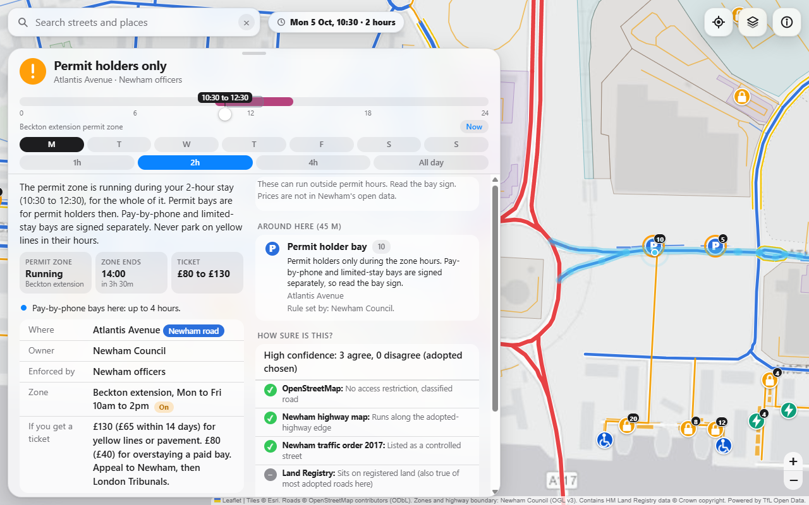
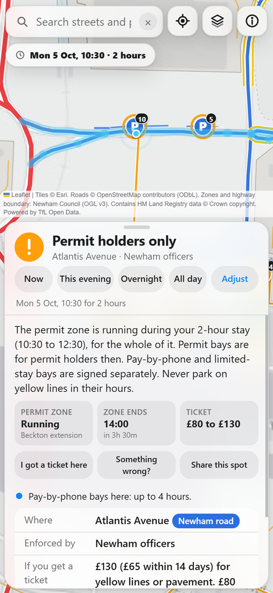
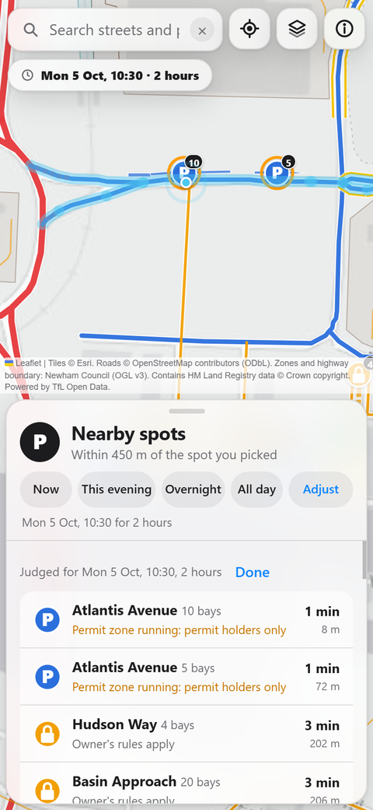
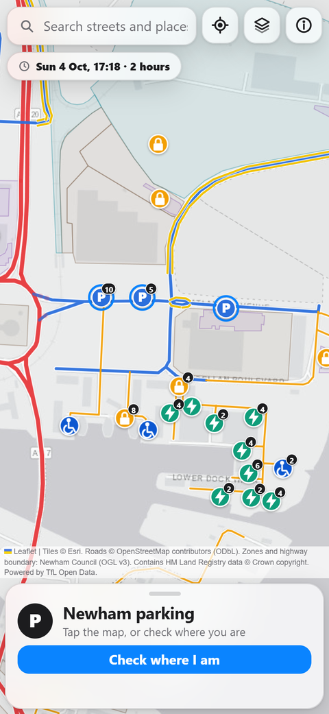

# Newham Parking Guide

**Whose road is this, who enforces the parking, and is a permit zone running while I'm parked here?**

A free, open-source map for every road in the London Borough of Newham. Tap a road, pick a time and how long you'll stay, and get a plain answer: who owns it, who sends the ticket, what it costs, how to appeal, and how sure we are.

<p align="center">
  
</p>
<p align="center">
  
  
  
</p>

**Use it:** the web app at **https://jeremy8776.github.io/newham-parking-guide/** (installs to your home screen) or the **Android APK** from the [Releases](../../releases) page.

> **Read this first.** The sign on the street always wins. This is a guide built from open data, not legal or parking advice, and it can be wrong. "Permit zone is off" does **not** mean you can park: yellow lines, loading bans and bay signs can still apply. See [Accuracy](#accuracy-and-limits).

## What it does

- **Who owns and enforces each road.** TfL Red Routes, Newham council roads, and private or unadopted roads, colour-coded. Each road shows the evidence behind its classification and a confidence level.
- **Time and stay length.** Choose a day, time and 1h / 2h / 4h / all day (or Now, This evening, Overnight). The answer covers the *whole stay*, not one moment. It also tells you when the zone next starts or ends.
- **Permit zones.** All 41 Newham zones, with hours parsed from Newham's own text, plus pay-by-phone bays, limits and kerb markings where mapped.
- **Pins that follow your time.** A blue ring means the permit zone is off for your stay, amber means it's running or you'd overstay a car park's limit. There is deliberately no green "free" ring.
- **Fines and appeals.** Penalty amounts, discount windows and the appeal route for TfL, Newham and private operators.
- **Check where I am.** One tap for the road you're standing on. A nearby list shows bays and car parks, nearest first.
- **Works offline.** The roads and rules are in the app. Only the map background needs signal.
- **Built for phones:** thumb-reachable sheet, 44px targets, safe areas, light and dark.

## Get it

| | |
|---|---|
| **Web / PWA** | https://jeremy8776.github.io/newham-parking-guide/ . On a phone, use "Add to Home Screen". It then works offline. |
| **Android APK** | Download `newham-parking-*-debug.apk` from [Releases](../../releases), open it, and allow "install unknown apps" for your browser when asked. It is a debug-signed build for testing, not a Play Store release. |
| **iPhone** | No app. Use the web app and Add to Home Screen. |

## How it works

```
sources/fetch_region.py   download raw open data into data/region/ (OSM, Newham ArcGIS, pay-by-phone lists, TfL)
build.py                  classify roads, cross-reference sources, infer bays, cut into tiles, write docs/
docs/                     the built site: index.html, tiles/, service worker, manifest. GitHub Pages and the APK serve this
js/ ui.css template.html  the app source, concatenated into docs/index.html
android/                  Capacitor wrapper that bundles docs/ into an APK
tests/                    Python and JavaScript unit tests
```

Road classification is a vote across independent sources (OpenStreetMap tags, Newham's adopted-highway map, the 2017 Gazette traffic order notice, Land Registry parcels, the TfL API, Newham's TfL road list). Every road keeps its votes, so the card can show who agreed and who didn't. Data is cut into small tiles that load as you pan, drawn in batches so the map stays smooth.

### Build it yourself

You need Python 3.11+ and Node 20+ (JDK 17 and the Android SDK only for the APK).

```bash
git clone https://github.com/Jeremy8776/newham-parking-guide
cd newham-parking-guide

python sources/fetch_region.py arc zones osm tfl   # download source data (about 45 MB, needs network, takes a few minutes)
python sources/fetch_pd.py                         # Land Registry parcels for the Gallions Reach area
python build.py                                    # writes docs/

python -m http.server -d docs 8000                 # then open http://localhost:8000
```

Tests: `python -m unittest discover -s tests && node tests/rules.test.js`

Android: `npm install && npx cap sync android && cd android && ./gradlew assembleDebug`. The APK lands in `android/app/build/outputs/apk/debug/`.

## Accuracy and limits

Be honest about what this is:

- **Ownership is inferred.** No public dataset says who owns every road. TfL roads and Newham's adopted highway are solid. "Private or unadopted" means *no adopted-highway boundary was found*, and newer adoptions can be missing. About a fifth of roads have sources that disagree, and the card says so.
- **Bay rules are inferred.** OpenStreetMap has no per-bay signs, so a Newham bay inside a zone is shown as a permit bay. Pay-by-phone and limited-stay bays are signed separately.
- **Yellow-line hours are not in any open data.** We show mapped lines, not their hours.
- **Land Registry parcels are only fetched for the Gallions Reach area**, and they name no owner. They carry low weight.
- **Car park limits** (for example Gallions Reach Shopping Park, Beckton Gateway) come from the operators' public pages and can change. Parkopedia lists some of these as closed at times where we say open, so treat them as unverified.
- **Only Newham has rules.** Neighbouring boroughs show roads and TfL Red Routes, not their zones. TfL Red Routes for all of Greater London are an optional layer.
- **Not tested on a real device by the author yet:** the Android APK and the phone layout have been checked in browser emulation only.
- **Data is a snapshot** (pulled 04/10/2026). It does not update itself.

## Contributing

Bug reports and data corrections are welcome. The most useful thing you can do is stand on a road, compare the card with the signs, and open an issue with what you saw. See [CONTRIBUTING.md](CONTRIBUTING.md). Branches: `dev` for work, `prod` for what is live.

## Licence

Code: [MIT](LICENSE). Data: not ours, see [DATA_LICENCES.md](DATA_LICENCES.md). Notably, OpenStreetMap-derived data is ODbL and share-alike, and the Esri map background has its own terms. Parkopedia and AppyParking were design references only. No data or text was taken from them.
